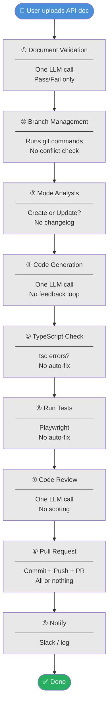
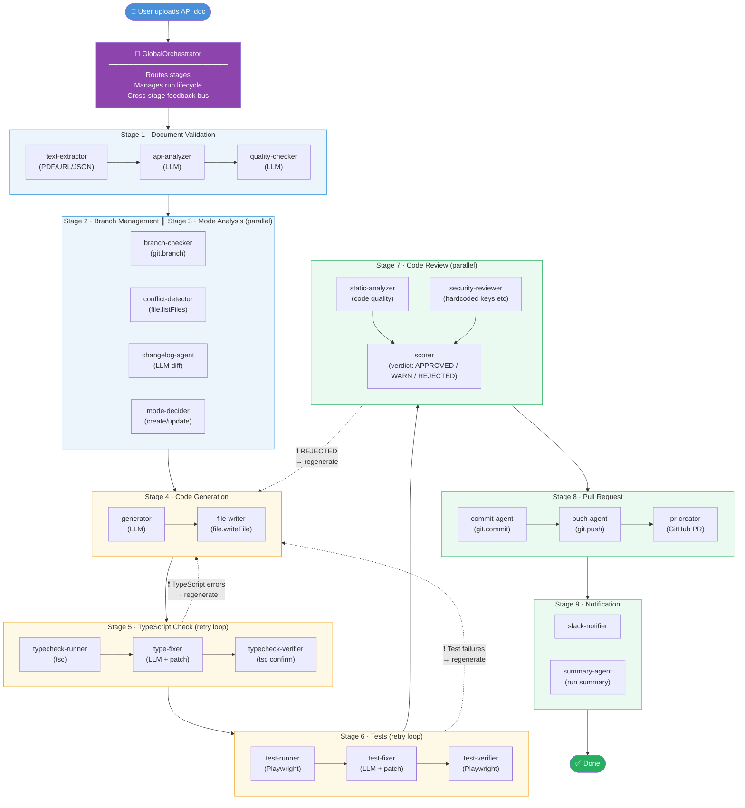
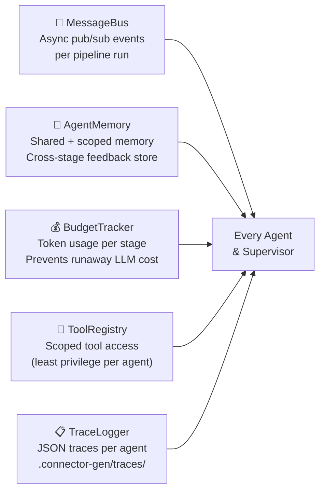

# Connector Generator — Architecture Comparison

## Old Architecture: Linear Pipeline

One step runs at a time. Each step is a single LLM call with no retry, no feedback, no parallelism.
If any step fails — the whole run fails with no recovery.

**Problems with the old approach:**
- ❌ TypeScript errors → whole run fails, no fix attempted
- ❌ Test failures → no retry, no diagnosis
- ❌ Bad review score → code still goes to PR
- ❌ PDF upload failure → cryptic error, no fallback
- ❌ No visibility into what each step is doing internally

---

## New Architecture: Multi-Agent System

Every stage is now a **Supervisor + Child Agents**. Agents run in parallel where possible,
retry on failure, and push feedback upstream so earlier stages can self-correct.

---

## Infrastructure Added (runs behind every stage)

---

## Side-by-Side Summary

| | Old Pipeline | New Multi-Agent |
|---|---|---|
| **Structure** | 9 sequential steps | 9 Supervisors × 2-3 Child Agents each |
| **Parallelism** | None | Security + Static review run in parallel; Branch + Analysis run in parallel |
| **TypeScript errors** | Run fails | Auto-fixed by LLM, re-verified |
| **Test failures** | Run fails | Auto-diagnosed and patched, re-run |
| **Bad review** | PR created anyway | Feedback sent back to codegen, regenerated |
| **PDF extraction** | Breaks on pdf-parse v2 | pdftotext CLI primary, lib fallback |
| **Observability** | console.log | JSON traces per agent in .connector-gen/traces/ |
| **Token cost control** | None | BudgetTracker per stage |
| **Rollout** | — | Feature flag: `useMultiAgent: false` (safe default) |
