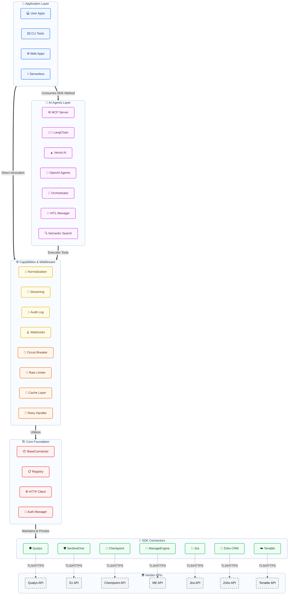
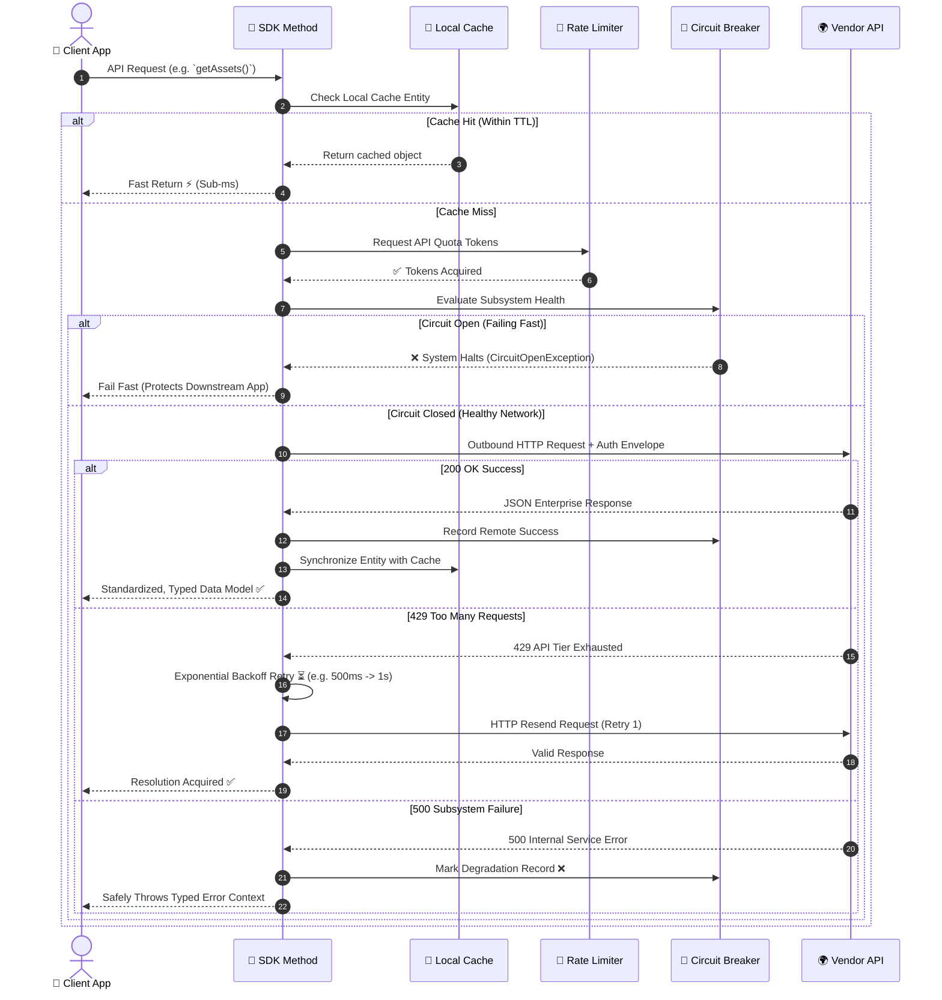
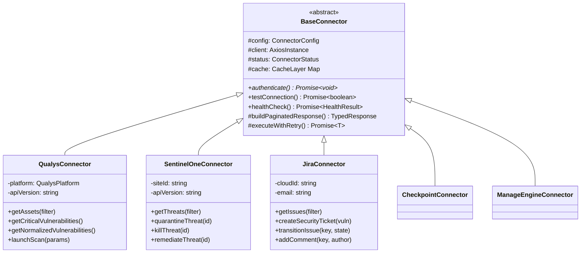

# 🏗️ Complyment Connectors SDK - Detailed Architecture

This document outlines the detailed architectural blueprints of the **@skill-mine/complyment-connectors-sdk**, designed for enterprise scale, resilience, and AI-native integration. These diagrams are generated using MermaidJS so they render natively in Markdown, providing an impressive technical presentation for management and stakeholders.

---

## 🗺️ 1. High-Level System Architecture

The SDK is deliberately layered to decouple external orchestration (AI, Applications) from internal execution logic, middleware services, and connector implementations.



---

## 🛡️ 2. Request Resilience & Data Flow

A major architectural highlight of the Connectors SDK is its robust middleware execution pipeline. It provides automatic self-healing, saving the engineering team hundreds of hours in error-handling boilerplate.



---

## 🧬 3. Extensible Class Hierarchy (OOP)

By enforcing an abstract base class pattern, the SDK maintains absolute 100% type-safety while scaling effortlessly when onboarding new vendor platforms.



---

## 🤖 4. AI-Native Tool Execution Flow

The Connectors SDK naturally wraps complex vendor implementations into localized AI-readable schema "Tools", empowering frameworks like `Vercel AI` and internal `MCP` Servers.

```mermaid
stateDiagram-v2
    [*] --> Context: User Prompts Orchestrator
    
    state AI_Agent {
        direction LR
        LLM[Large Language Model]
        Context[System Context Window]
    }
    
    AI_Agent --> Adapter: Decides to "Call Tool" (e.g. get_critical_vulns)
    
    state Framework_Adapter {
        direction TB
        Adapter[MCP / Langchain Wrapper] --> Parse[Translate AI Schema -> SDK Call]
    }
    
    Parse --> Execution_Engine: Invoke Native Function
    
    state Execution_Engine {
        direction LR
        isHighRisk{High Risk Mutator?}
        isHighRisk --> Approval_Layer: Yes (e.g. 'killThreat')
        isHighRisk --> Vendor_Execution: No (e.g. 'fetchAssets')
    }
    
    Approval_Layer --> Vendor_Execution: Human-In-The-Loop Approves ✅
    Approval_Layer --> Reject_State: Human Denies Execution ❌
    
    Vendor_Execution --> Native_Ext: API Secure Invocation
    Native_Ext --> Context: Normalize Telemetry & Yield to Context
    Context --> AI_Agent: Feedback Loop & AI Confirmation
```
