# Skillmine Connectors SDK - Architecture Diagrams

## 0. The Problem — Before This SDK

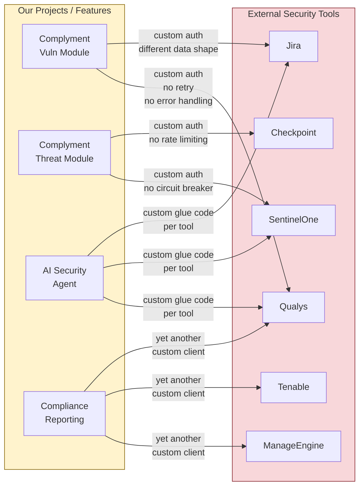
```mermaid
flowchart LR
    subgraph PROJECTS["Our Projects / Features"]
        P1["Complyment\nVuln Module"]
        P2["Complyment\nThreat Module"]
        P3["AI Security\nAgent"]
        P4["Compliance\nReporting"]
    end

    subgraph TOOLS["External Security Tools"]
        Q["Qualys"]
        S1["SentinelOne"]
        CP["Checkpoint"]
        ME["ManageEngine"]
        J["Jira"]
        T["Tenable"]
    end

    P1 -->|"custom auth\nno retry\nno error handling"| Q
    P1 -->|"custom auth\ndifferent data shape"| J
    P2 -->|"custom auth\nno circuit breaker"| S1
    P2 -->|"custom auth\nno rate limiting"| CP
    P3 -->|"custom glue code\nper tool"| Q
    P3 -->|"custom glue code\nper tool"| S1
    P3 -->|"custom glue code\nper tool"| J
    P4 -->|"yet another\ncustom client"| ME
    P4 -->|"yet another\ncustom client"| T
    P4 -->|"yet another\ncustom client"| Q

    style PROJECTS fill:#fff3cd,stroke:#856404
    style TOOLS fill:#f8d7da,stroke:#842029
```

**Problems visible in this diagram:**
- Every arrow is a separate, custom implementation
- No shared auth, retry, circuit breaker, or rate limiting
- Qualys is integrated 3 times across different projects — independently
- AI agents need custom glue code for every tool
- Data from Qualys and SentinelOne has different schemas — no normalization

---

## 0b. The Solution — After This SDK

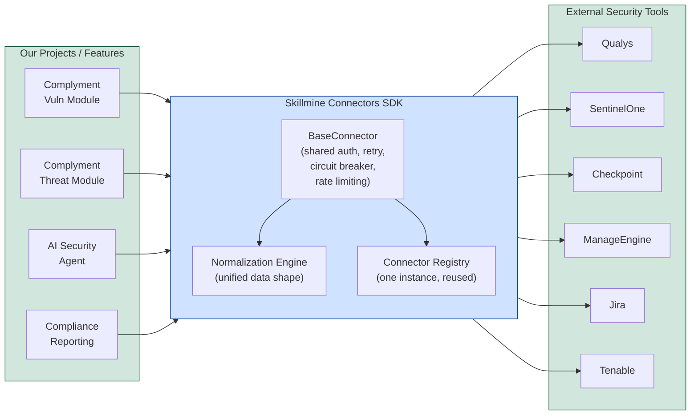
```mermaid
flowchart LR
    subgraph PROJECTS["Our Projects / Features"]
        P1["Complyment\nVuln Module"]
        P2["Complyment\nThreat Module"]
        P3["AI Security\nAgent"]
        P4["Compliance\nReporting"]
    end

    subgraph SDK["Skillmine Connectors SDK"]
        direction TB
        BC["BaseConnector\n(shared auth, retry,\ncircuit breaker,\nrate limiting)"]
        NE["Normalization Engine\n(unified data shape)"]
        REG["Connector Registry\n(one instance, reused)"]
        BC --> NE
        BC --> REG
    end

    subgraph TOOLS["External Security Tools"]
        Q["Qualys"]
        S1["SentinelOne"]
        CP["Checkpoint"]
        ME["ManageEngine"]
        J["Jira"]
        T["Tenable"]
    end

    P1 --> SDK
    P2 --> SDK
    P3 --> SDK
    P4 --> SDK

    SDK --> Q
    SDK --> S1
    SDK --> CP
    SDK --> ME
    SDK --> J
    SDK --> T

    style PROJECTS fill:#d1e7dd,stroke:#0f5132
    style SDK fill:#cfe2ff,stroke:#084298
    style TOOLS fill:#d1e7dd,stroke:#0f5132
```

**What changed:**
- All 4 projects connect through **one SDK** — no duplication
- Auth, retry, circuit breaker, rate limiting live in `BaseConnector` — written once
- Qualys integrated once — all projects reuse the same connector
- Normalization Engine means every tool returns the same data shape
- AI Agent no longer needs custom glue — just calls the connector

---

## 1. High-Level Architecture Overview

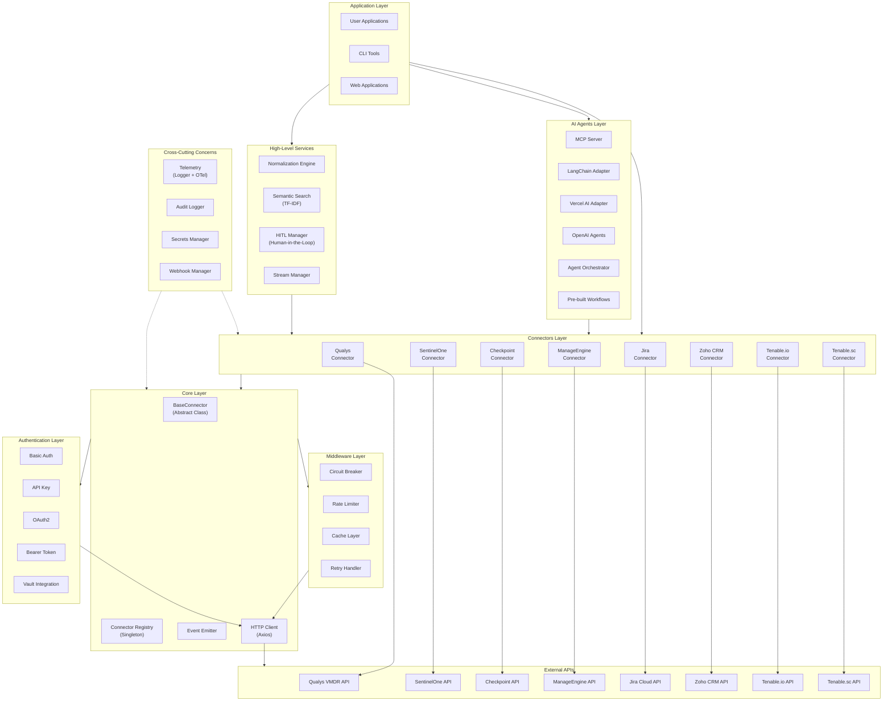
```mermaid
flowchart TB
    subgraph APP["Application Layer"]
        UserApp["User Applications"]
        CLI["CLI Tools"]
        WebApp["Web Applications"]
    end

    subgraph AI["AI Agents Layer"]
        MCP["MCP Server"]
        LangChain["LangChain Adapter"]
        VercelAI["Vercel AI Adapter"]
        OpenAI["OpenAI Agents"]
        Orchestrator["Agent Orchestrator"]
        Workflows["Pre-built Workflows"]
    end

    subgraph SERVICES["High-Level Services"]
        Normalization["Normalization Engine"]
        SemanticSearch["Semantic Search<br/>(TF-IDF)"]
        HITL["HITL Manager<br/>(Human-in-the-Loop)"]
        StreamMgr["Stream Manager"]
    end

    subgraph CONNECTORS["Connectors Layer"]
        Qualys["Qualys<br/>Connector"]
        SentinelOne["SentinelOne<br/>Connector"]
        Checkpoint["Checkpoint<br/>Connector"]
        ManageEngine["ManageEngine<br/>Connector"]
        Jira["Jira<br/>Connector"]
        Zoho["Zoho CRM<br/>Connector"]
        TenableIO["Tenable.io<br/>Connector"]
        TenableSC["Tenable.sc<br/>Connector"]
    end

    subgraph CORE["Core Layer"]
        BaseConnector["BaseConnector<br/>(Abstract Class)"]
        Registry["Connector Registry<br/>(Singleton)"]
        EventEmitter["Event Emitter"]
        HTTPClient["HTTP Client<br/>(Axios)"]
    end

    subgraph MIDDLEWARE["Middleware Layer"]
        CircuitBreaker["Circuit Breaker"]
        RateLimiter["Rate Limiter"]
        CacheLayer["Cache Layer"]
        RetryHandler["Retry Handler"]
    end

    subgraph CROSSCUT["Cross-Cutting Concerns"]
        Telemetry["Telemetry<br/>(Logger + OTel)"]
        AuditLog["Audit Logger"]
        Secrets["Secrets Manager"]
        Webhooks["Webhook Manager"]
    end

    subgraph AUTH["Authentication Layer"]
        BasicAuth["Basic Auth"]
        APIKey["API Key"]
        OAuth2["OAuth2"]
        Bearer["Bearer Token"]
        Vault["Vault Integration"]
    end

    subgraph EXTERNAL["External APIs"]
        QualysAPI["Qualys VMDR API"]
        S1API["SentinelOne API"]
        CPAPI["Checkpoint API"]
        MEAPI["ManageEngine API"]
        JiraAPI["Jira Cloud API"]
        ZohoAPI["Zoho CRM API"]
        TIOApi["Tenable.io API"]
        TSCApi["Tenable.sc API"]
    end

    APP --> AI
    APP --> SERVICES
    APP --> CONNECTORS
    AI --> CONNECTORS
    SERVICES --> CONNECTORS
    CONNECTORS --> CORE
    CORE --> MIDDLEWARE
    CORE --> AUTH
    MIDDLEWARE --> HTTPClient
    AUTH --> HTTPClient
    CROSSCUT -.-> CORE
    CROSSCUT -.-> CONNECTORS
    HTTPClient --> EXTERNAL

    Qualys --> QualysAPI
    SentinelOne --> S1API
    Checkpoint --> CPAPI
    ManageEngine --> MEAPI
    Jira --> JiraAPI
    Zoho --> ZohoAPI
    TenableIO --> TIOApi
    TenableSC --> TSCApi
```

---

## 2. Core Layer - BaseConnector Detail

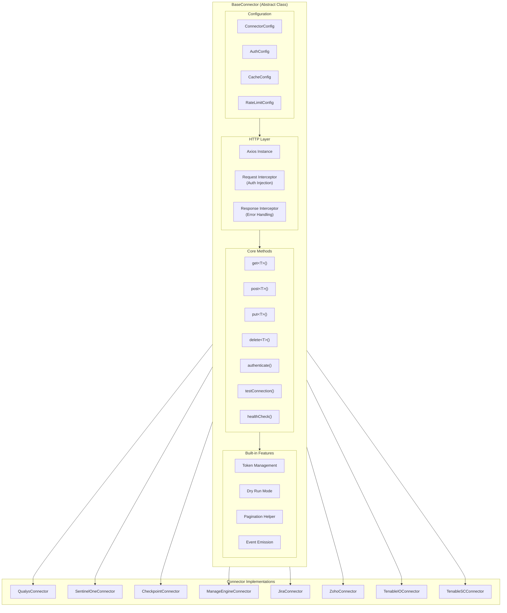
```mermaid
flowchart TB
    subgraph BaseConnector["BaseConnector (Abstract Class)"]
        direction TB

        subgraph Config["Configuration"]
            ConnConfig["ConnectorConfig"]
            AuthConfig["AuthConfig"]
            CacheConfig["CacheConfig"]
            RateLimitConfig["RateLimitConfig"]
        end

        subgraph HTTPLayer["HTTP Layer"]
            AxiosInstance["Axios Instance"]
            ReqInterceptor["Request Interceptor<br/>(Auth Injection)"]
            ResInterceptor["Response Interceptor<br/>(Error Handling)"]
        end

        subgraph Methods["Core Methods"]
            Get["get&lt;T&gt;()"]
            Post["post&lt;T&gt;()"]
            Put["put&lt;T&gt;()"]
            Delete["delete&lt;T&gt;()"]
            Authenticate["authenticate()"]
            TestConnection["testConnection()"]
            HealthCheck["healthCheck()"]
        end

        subgraph Features["Built-in Features"]
            TokenMgmt["Token Management"]
            DryRun["Dry Run Mode"]
            Pagination["Pagination Helper"]
            Events["Event Emission"]
        end
    end

    subgraph Inheritance["Connector Implementations"]
        QualysImpl["QualysConnector"]
        S1Impl["SentinelOneConnector"]
        CPImpl["CheckpointConnector"]
        MEImpl["ManageEngineConnector"]
        JiraImpl["JiraConnector"]
        ZohoImpl["ZohoConnector"]
        TIOImpl["TenableIOConnector"]
        TSCImpl["TenableSCConnector"]
    end

    BaseConnector --> QualysImpl
    BaseConnector --> S1Impl
    BaseConnector --> CPImpl
    BaseConnector --> MEImpl
    BaseConnector --> JiraImpl
    BaseConnector --> ZohoImpl
    BaseConnector --> TIOImpl
    BaseConnector --> TSCImpl

    Config --> HTTPLayer
    HTTPLayer --> Methods
    Methods --> Features
```

---

## 3. Request Flow - Detailed Sequence

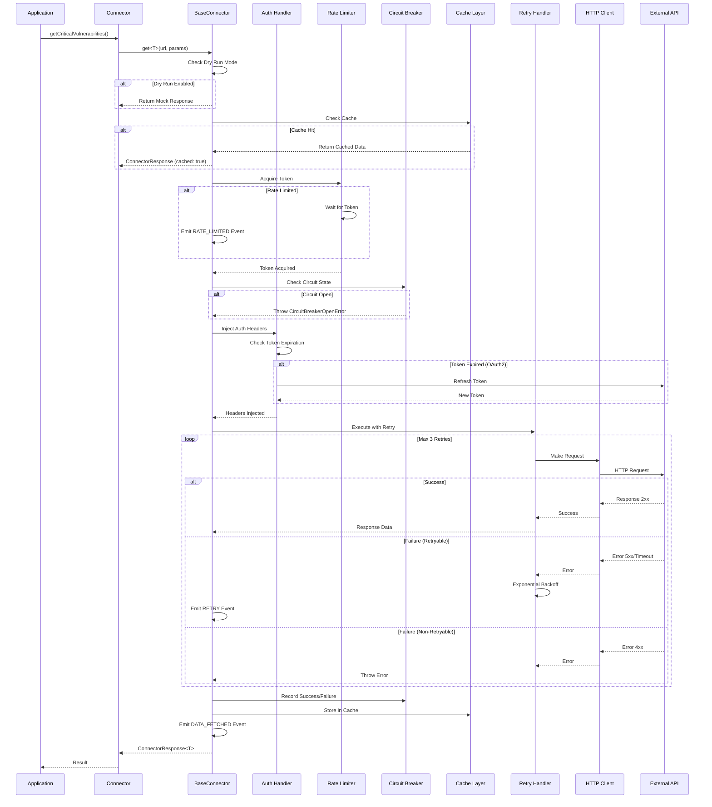
```mermaid
sequenceDiagram
    participant App as Application
    participant Conn as Connector
    participant Base as BaseConnector
    participant Auth as Auth Handler
    participant RL as Rate Limiter
    participant CB as Circuit Breaker
    participant Cache as Cache Layer
    participant Retry as Retry Handler
    participant HTTP as HTTP Client
    participant API as External API

    App->>Conn: getCriticalVulnerabilities()
    Conn->>Base: get<T>(url, params)

    Base->>Base: Check Dry Run Mode
    alt Dry Run Enabled
        Base-->>Conn: Return Mock Response
    end

    Base->>Cache: Check Cache
    alt Cache Hit
        Cache-->>Base: Return Cached Data
        Base-->>Conn: ConnectorResponse (cached: true)
    end

    Base->>RL: Acquire Token
    alt Rate Limited
        RL->>RL: Wait for Token
        Base->>Base: Emit RATE_LIMITED Event
    end
    RL-->>Base: Token Acquired

    Base->>CB: Check Circuit State
    alt Circuit Open
        CB-->>Base: Throw CircuitBreakerOpenError
    end

    Base->>Auth: Inject Auth Headers
    Auth->>Auth: Check Token Expiration
    alt Token Expired (OAuth2)
        Auth->>API: Refresh Token
        API-->>Auth: New Token
    end
    Auth-->>Base: Headers Injected

    Base->>Retry: Execute with Retry
    loop Max 3 Retries
        Retry->>HTTP: Make Request
        HTTP->>API: HTTP Request

        alt Success
            API-->>HTTP: Response 2xx
            HTTP-->>Retry: Success
            Retry-->>Base: Response Data
        else Failure (Retryable)
            API-->>HTTP: Error 5xx/Timeout
            HTTP-->>Retry: Error
            Retry->>Retry: Exponential Backoff
            Base->>Base: Emit RETRY Event
        else Failure (Non-Retryable)
            API-->>HTTP: Error 4xx
            HTTP-->>Retry: Error
            Retry-->>Base: Throw Error
        end
    end

    Base->>CB: Record Success/Failure
    Base->>Cache: Store in Cache
    Base->>Base: Emit DATA_FETCHED Event
    Base-->>Conn: ConnectorResponse<T>
    Conn-->>App: Result
```

---

## 4. Middleware Layer Detail

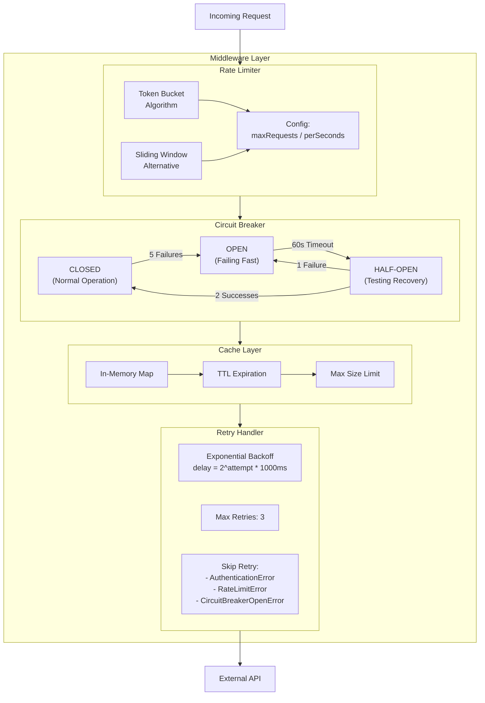
```mermaid
flowchart TB
    subgraph Middleware["Middleware Layer"]
        subgraph CB["Circuit Breaker"]
            CBClosed["CLOSED<br/>(Normal Operation)"]
            CBOpen["OPEN<br/>(Failing Fast)"]
            CBHalfOpen["HALF-OPEN<br/>(Testing Recovery)"]

            CBClosed -->|"5 Failures"| CBOpen
            CBOpen -->|"60s Timeout"| CBHalfOpen
            CBHalfOpen -->|"2 Successes"| CBClosed
            CBHalfOpen -->|"1 Failure"| CBOpen
        end

        subgraph RL["Rate Limiter"]
            TokenBucket["Token Bucket<br/>Algorithm"]
            SlidingWindow["Sliding Window<br/>Alternative"]
            RLConfig["Config:<br/>maxRequests / perSeconds"]

            TokenBucket --> RLConfig
            SlidingWindow --> RLConfig
        end

        subgraph CL["Cache Layer"]
            MemCache["In-Memory Map"]
            TTL["TTL Expiration"]
            MaxSize["Max Size Limit"]

            MemCache --> TTL
            TTL --> MaxSize
        end

        subgraph RH["Retry Handler"]
            ExpBackoff["Exponential Backoff<br/>delay = 2^attempt * 1000ms"]
            MaxRetries["Max Retries: 3"]
            NonRetryable["Skip Retry:<br/>- AuthenticationError<br/>- RateLimitError<br/>- CircuitBreakerOpenError"]
        end
    end

    Request["Incoming Request"] --> RL
    RL --> CB
    CB --> CL
    CL --> RH
    RH --> API["External API"]
```

---

## 5. Authentication Flow

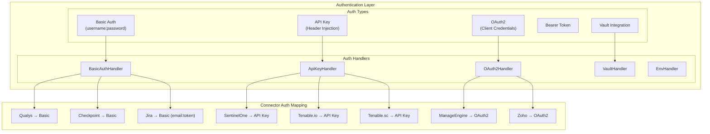
```mermaid
flowchart TB
    subgraph AuthLayer["Authentication Layer"]
        subgraph AuthTypes["Auth Types"]
            Basic["Basic Auth<br/>(username:password)"]
            APIKey["API Key<br/>(Header Injection)"]
            OAuth2["OAuth2<br/>(Client Credentials)"]
            Bearer["Bearer Token"]
            VaultAuth["Vault Integration"]
        end

        subgraph Handlers["Auth Handlers"]
            BasicHandler["BasicAuthHandler"]
            APIKeyHandler["ApiKeyHandler"]
            OAuth2Handler["OAuth2Handler"]
            VaultHandler["VaultHandler"]
            EnvHandler["EnvHandler"]
        end
    end

    subgraph Connectors["Connector Auth Mapping"]
        QualysAuth["Qualys → Basic"]
        S1Auth["SentinelOne → API Key"]
        CPAuth["Checkpoint → Basic"]
        MEAuth["ManageEngine → OAuth2"]
        JiraAuth["Jira → Basic (email:token)"]
        ZohoAuth["Zoho → OAuth2"]
        TIOAuth["Tenable.io → API Key"]
        TSCAuth["Tenable.sc → API Key"]
    end

    Basic --> BasicHandler
    APIKey --> APIKeyHandler
    OAuth2 --> OAuth2Handler
    VaultAuth --> VaultHandler

    BasicHandler --> QualysAuth
    BasicHandler --> CPAuth
    BasicHandler --> JiraAuth
    APIKeyHandler --> S1Auth
    APIKeyHandler --> TIOAuth
    APIKeyHandler --> TSCAuth
    OAuth2Handler --> MEAuth
    OAuth2Handler --> ZohoAuth
```

---

## 6. OAuth2 Token Flow

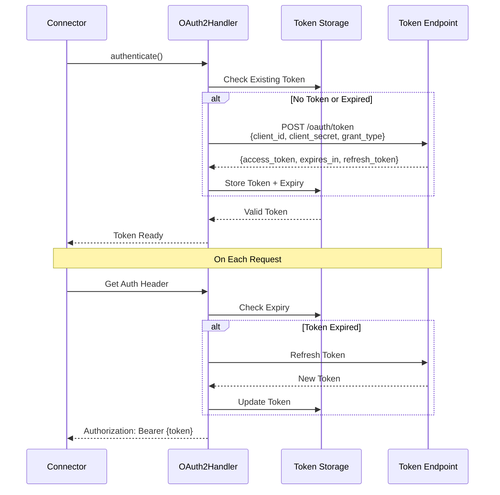
```mermaid
sequenceDiagram
    participant Conn as Connector
    participant OAuth as OAuth2Handler
    participant Token as Token Storage
    participant API as Token Endpoint

    Conn->>OAuth: authenticate()
    OAuth->>Token: Check Existing Token

    alt No Token or Expired
        OAuth->>API: POST /oauth/token<br/>{client_id, client_secret, grant_type}
        API-->>OAuth: {access_token, expires_in, refresh_token}
        OAuth->>Token: Store Token + Expiry
    end

    Token-->>OAuth: Valid Token
    OAuth-->>Conn: Token Ready

    Note over Conn,API: On Each Request
    Conn->>OAuth: Get Auth Header
    OAuth->>Token: Check Expiry

    alt Token Expired
        OAuth->>API: Refresh Token
        API-->>OAuth: New Token
        OAuth->>Token: Update Token
    end

    OAuth-->>Conn: Authorization: Bearer {token}
```

---

## 7. AI Agents Integration Architecture

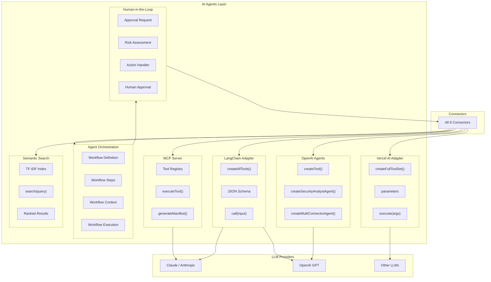
```mermaid
flowchart TB
    subgraph AILayer["AI Agents Layer"]
        subgraph MCP["MCP Server"]
            MCPTools["Tool Registry"]
            MCPExecute["executeTool()"]
            MCPManifest["generateManifest()"]
        end

        subgraph LC["LangChain Adapter"]
            LCTools["createAllTools()"]
            LCSchema["JSON Schema"]
            LCCall["call(input)"]
        end

        subgraph VAI["Vercel AI Adapter"]
            VAITools["createFullToolSet()"]
            VAIParams["parameters"]
            VAIExecute["execute(args)"]
        end

        subgraph OAI["OpenAI Agents"]
            OAITools["createTool()"]
            OAIAgent["createSecurityAnalystAgent()"]
            OAIMulti["createMultiConnectorAgent()"]
        end

        subgraph Orchestration["Agent Orchestration"]
            Workflow["Workflow Definition"]
            Steps["Workflow Steps"]
            Context["Workflow Context"]
            Execution["Workflow Execution"]
        end

        subgraph HITL["Human-in-the-Loop"]
            Request["Approval Request"]
            RiskLevel["Risk Assessment"]
            Handler["Action Handler"]
            Approval["Human Approval"]
        end

        subgraph Semantic["Semantic Search"]
            Index["TF-IDF Index"]
            Search["search(query)"]
            Results["Ranked Results"]
        end
    end

    subgraph LLMs["LLM Providers"]
        Claude["Claude / Anthropic"]
        GPT["OpenAI GPT"]
        Other["Other LLMs"]
    end

    subgraph Connectors["Connectors"]
        AllConn["All 8 Connectors"]
    end

    MCP --> Claude
    LC --> GPT
    LC --> Claude
    VAI --> Other
    OAI --> GPT

    AllConn --> MCP
    AllConn --> LC
    AllConn --> VAI
    AllConn --> OAI
    AllConn --> Orchestration
    AllConn --> Semantic

    Orchestration --> HITL
    HITL --> AllConn
```

---

## 8. Normalization Engine Flow

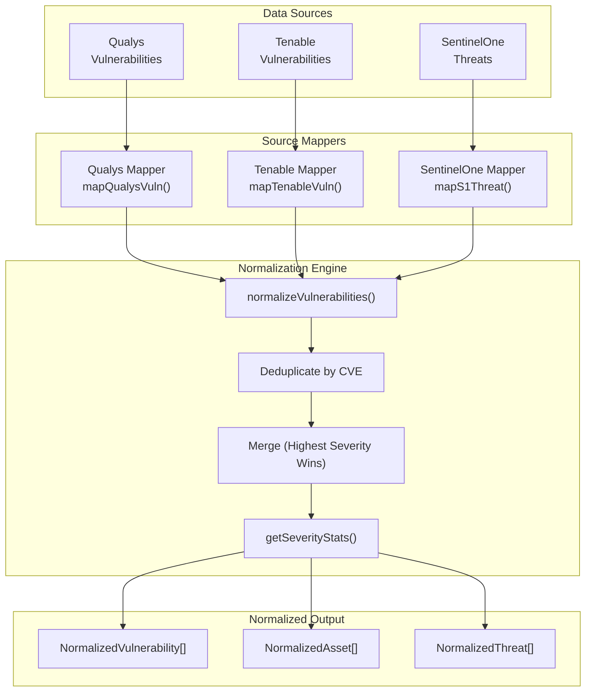
```mermaid
flowchart TB
    subgraph Sources["Data Sources"]
        QualysData["Qualys<br/>Vulnerabilities"]
        TenableData["Tenable<br/>Vulnerabilities"]
        S1Data["SentinelOne<br/>Threats"]
    end

    subgraph Mappers["Source Mappers"]
        QMapper["Qualys Mapper<br/>mapQualysVuln()"]
        TMapper["Tenable Mapper<br/>mapTenableVuln()"]
        S1Mapper["SentinelOne Mapper<br/>mapS1Threat()"]
    end

    subgraph Engine["Normalization Engine"]
        Normalize["normalizeVulnerabilities()"]
        Dedupe["Deduplicate by CVE"]
        Merge["Merge (Highest Severity Wins)"]
        Stats["getSeverityStats()"]
    end

    subgraph Output["Normalized Output"]
        NormVuln["NormalizedVulnerability[]"]
        NormAsset["NormalizedAsset[]"]
        NormThreat["NormalizedThreat[]"]
    end

    QualysData --> QMapper
    TenableData --> TMapper
    S1Data --> S1Mapper

    QMapper --> Normalize
    TMapper --> Normalize
    S1Mapper --> Normalize

    Normalize --> Dedupe
    Dedupe --> Merge
    Merge --> Stats
    Stats --> NormVuln
    Stats --> NormAsset
    Stats --> NormThreat
```

---

## 9. Normalized Data Schema

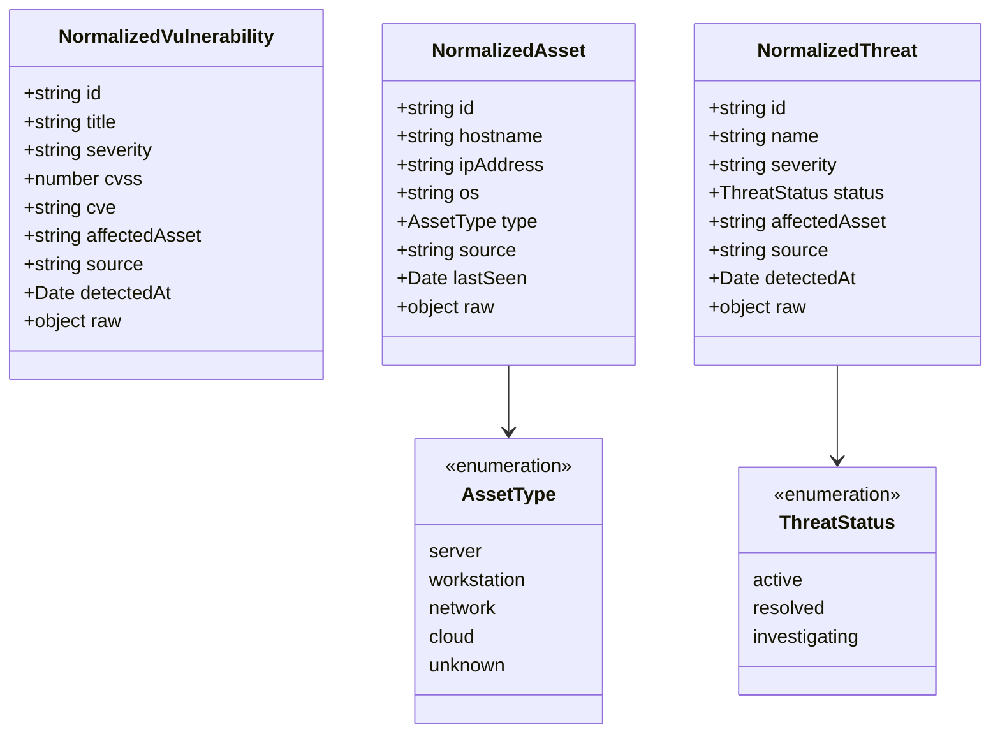
```mermaid
classDiagram
    class NormalizedVulnerability {
        +string id
        +string title
        +string severity
        +number cvss
        +string cve
        +string affectedAsset
        +string source
        +Date detectedAt
        +object raw
    }

    class NormalizedAsset {
        +string id
        +string hostname
        +string ipAddress
        +string os
        +AssetType type
        +string source
        +Date lastSeen
        +object raw
    }

    class NormalizedThreat {
        +string id
        +string name
        +string severity
        +ThreatStatus status
        +string affectedAsset
        +string source
        +Date detectedAt
        +object raw
    }

    class AssetType {
        <<enumeration>>
        server
        workstation
        network
        cloud
        unknown
    }

    class ThreatStatus {
        <<enumeration>>
        active
        resolved
        investigating
    }

    NormalizedAsset --> AssetType
    NormalizedThreat --> ThreatStatus
```

---

## 10. Cross-Cutting Concerns

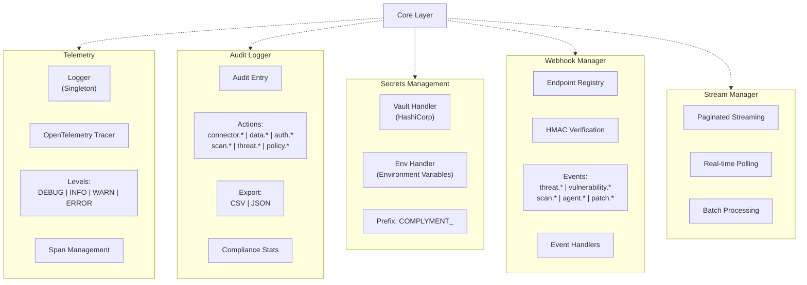
```mermaid
flowchart TB
    subgraph Telemetry["Telemetry"]
        Logger["Logger<br/>(Singleton)"]
        Tracer["OpenTelemetry Tracer"]
        LogLevels["Levels:<br/>DEBUG | INFO | WARN | ERROR"]
        Spans["Span Management"]
    end

    subgraph Audit["Audit Logger"]
        AuditEntry["Audit Entry"]
        Actions["Actions:<br/>connector.* | data.* | auth.*<br/>scan.* | threat.* | policy.*"]
        Export["Export:<br/>CSV | JSON"]
        Stats["Compliance Stats"]
    end

    subgraph Secrets["Secrets Management"]
        VaultInt["Vault Handler<br/>(HashiCorp)"]
        EnvInt["Env Handler<br/>(Environment Variables)"]
        Prefix["Prefix: COMPLYMENT_"]
    end

    subgraph Webhooks["Webhook Manager"]
        Endpoints["Endpoint Registry"]
        HMAC["HMAC Verification"]
        EventTypes["Events:<br/>threat.* | vulnerability.*<br/>scan.* | agent.* | patch.*"]
        Handlers["Event Handlers"]
    end

    subgraph Streaming["Stream Manager"]
        Paginated["Paginated Streaming"]
        Polling["Real-time Polling"]
        Batches["Batch Processing"]
    end

    Core["Core Layer"] -.-> Telemetry
    Core -.-> Audit
    Core -.-> Secrets
    Core -.-> Webhooks
    Core -.-> Streaming
```

---

## 11. Connector Registry Pattern

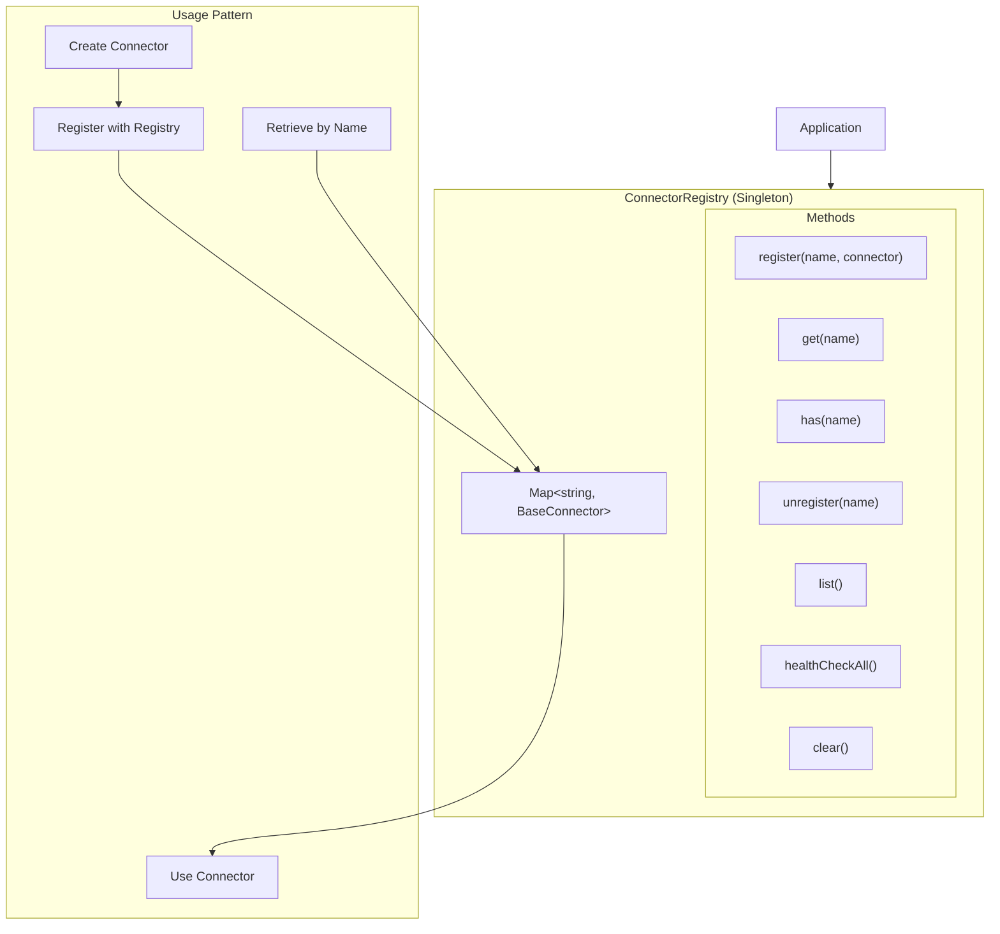
```mermaid
flowchart TB
    subgraph Registry["ConnectorRegistry (Singleton)"]
        Store["Map&lt;string, BaseConnector&gt;"]

        subgraph Methods["Methods"]
            Register["register(name, connector)"]
            Get["get(name)"]
            Has["has(name)"]
            Unregister["unregister(name)"]
            List["list()"]
            HealthAll["healthCheckAll()"]
            Clear["clear()"]
        end
    end

    subgraph Usage["Usage Pattern"]
        Create["Create Connector"]
        RegisterConn["Register with Registry"]
        Retrieve["Retrieve by Name"]
        Use["Use Connector"]
    end

    Create --> RegisterConn
    RegisterConn --> Store
    Retrieve --> Store
    Store --> Use

    App["Application"] --> Registry
```

---

## 12. Event System

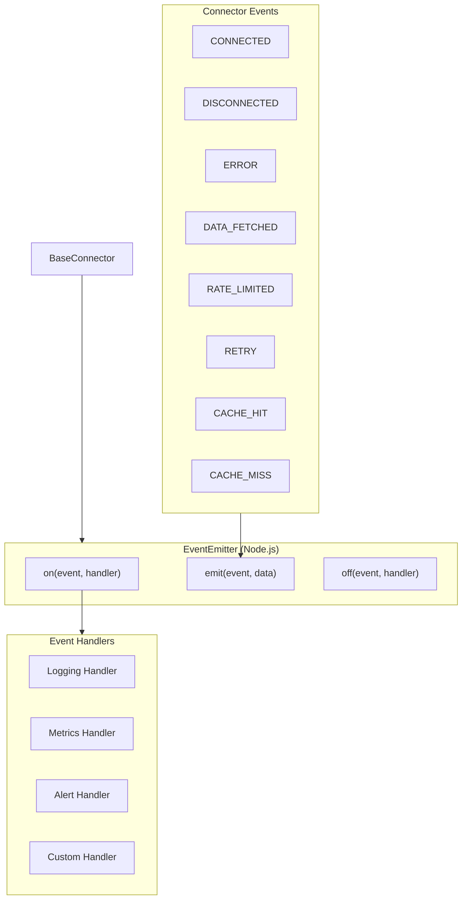
```mermaid
flowchart TB
    subgraph Events["Connector Events"]
        CONNECTED["CONNECTED"]
        DISCONNECTED["DISCONNECTED"]
        ERROR["ERROR"]
        DATA_FETCHED["DATA_FETCHED"]
        RATE_LIMITED["RATE_LIMITED"]
        RETRY["RETRY"]
        CACHE_HIT["CACHE_HIT"]
        CACHE_MISS["CACHE_MISS"]
    end

    subgraph Emitter["EventEmitter (Node.js)"]
        On["on(event, handler)"]
        Emit["emit(event, data)"]
        Off["off(event, handler)"]
    end

    subgraph Handlers["Event Handlers"]
        LogHandler["Logging Handler"]
        MetricsHandler["Metrics Handler"]
        AlertHandler["Alert Handler"]
        CustomHandler["Custom Handler"]
    end

    Events --> Emit
    On --> Handlers

    BaseConn["BaseConnector"] --> Emitter
```

---

## 13. Error Handling Hierarchy

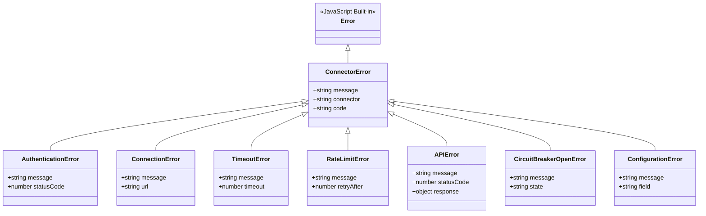
```mermaid
classDiagram
    class Error {
        <<JavaScript Built-in>>
    }

    class ConnectorError {
        +string message
        +string connector
        +string code
    }

    class AuthenticationError {
        +string message
        +number statusCode
    }

    class ConnectionError {
        +string message
        +string url
    }

    class TimeoutError {
        +string message
        +number timeout
    }

    class RateLimitError {
        +string message
        +number retryAfter
    }

    class APIError {
        +string message
        +number statusCode
        +object response
    }

    class CircuitBreakerOpenError {
        +string message
        +string state
    }

    class ConfigurationError {
        +string message
        +string field
    }

    Error <|-- ConnectorError
    ConnectorError <|-- AuthenticationError
    ConnectorError <|-- ConnectionError
    ConnectorError <|-- TimeoutError
    ConnectorError <|-- RateLimitError
    ConnectorError <|-- APIError
    ConnectorError <|-- CircuitBreakerOpenError
    ConnectorError <|-- ConfigurationError
```

---

## 14. Complete System Integration

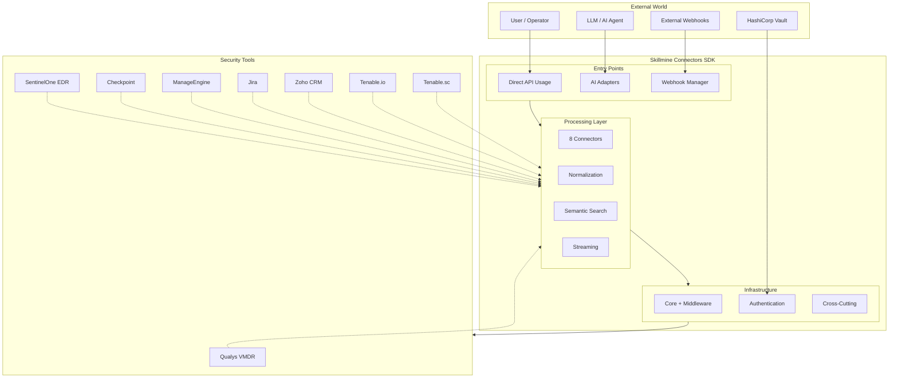
```mermaid
flowchart TB
    subgraph External["External World"]
        User["User / Operator"]
        LLM["LLM / AI Agent"]
        ExtWebhook["External Webhooks"]
        Vault["HashiCorp Vault"]
    end

    subgraph SDK["Skillmine Connectors SDK"]
        subgraph Entry["Entry Points"]
            DirectAPI["Direct API Usage"]
            AIAdapter["AI Adapters"]
            WebhookMgr["Webhook Manager"]
        end

        subgraph Processing["Processing Layer"]
            Connectors["8 Connectors"]
            Normalize["Normalization"]
            Search["Semantic Search"]
            Stream["Streaming"]
        end

        subgraph Infrastructure["Infrastructure"]
            Core["Core + Middleware"]
            Auth["Authentication"]
            CrossCut["Cross-Cutting"]
        end
    end

    subgraph SecurityTools["Security Tools"]
        Qualys["Qualys VMDR"]
        S1["SentinelOne EDR"]
        CP["Checkpoint"]
        ME["ManageEngine"]
        JiraT["Jira"]
        ZohoT["Zoho CRM"]
        TIO["Tenable.io"]
        TSC["Tenable.sc"]
    end

    User --> DirectAPI
    LLM --> AIAdapter
    ExtWebhook --> WebhookMgr
    Vault --> Auth

    Entry --> Processing
    Processing --> Infrastructure
    Infrastructure --> SecurityTools

    Qualys -.-> Processing
    S1 -.-> Processing
    CP -.-> Processing
    ME -.-> Processing
    JiraT -.-> Processing
    ZohoT -.-> Processing
    TIO -.-> Processing
    TSC -.-> Processing
```

---

## 15. Deployment View

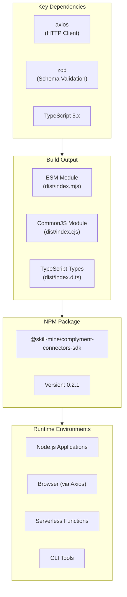
```mermaid
flowchart TB
    subgraph Build["Build Output"]
        ESM["ESM Module<br/>(dist/index.mjs)"]
        CJS["CommonJS Module<br/>(dist/index.cjs)"]
        Types["TypeScript Types<br/>(dist/index.d.ts)"]
    end

    subgraph Runtime["Runtime Environments"]
        NodeJS["Node.js Applications"]
        Browser["Browser (via Axios)"]
        Serverless["Serverless Functions"]
        CLI["CLI Tools"]
    end

    subgraph Dependencies["Key Dependencies"]
        Axios["axios<br/>(HTTP Client)"]
        Zod["zod<br/>(Schema Validation)"]
        TS["TypeScript 5.x"]
    end

    subgraph Package["NPM Package"]
        NPM["@skill-mine/complyment-connectors-sdk"]
        Version["Version: 0.2.1"]
    end

    Build --> Package
    Package --> Runtime
    Dependencies --> Build
```

---

## Usage

To render these diagrams:

1. **GitHub/GitLab**: Markdown files with Mermaid blocks render automatically
2. **VS Code**: Install "Markdown Preview Mermaid Support" extension
3. **Online**: Use [Mermaid Live Editor](https://mermaid.live/)
4. **Documentation**: Tools like Docusaurus, MkDocs support Mermaid

---

# Detailed Component Diagrams

## 16. Qualys Connector - Detailed Architecture

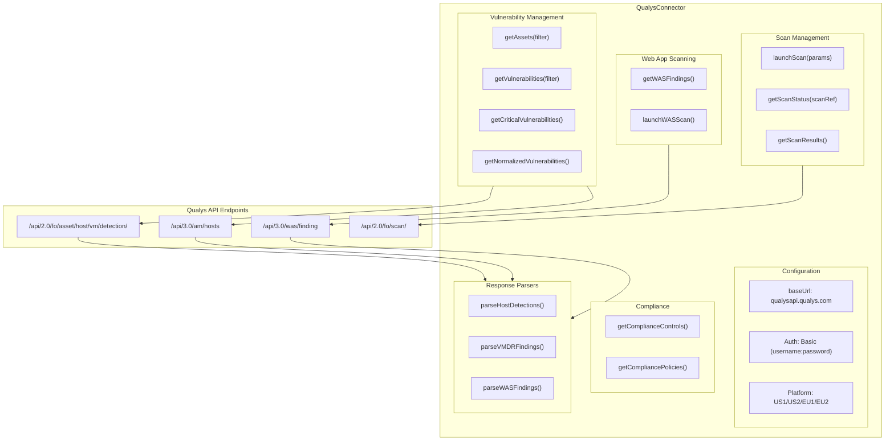
```mermaid
flowchart TB
    subgraph QualysConnector["QualysConnector"]
        subgraph Config["Configuration"]
            BaseURL["baseUrl: qualysapi.qualys.com"]
            Auth["Auth: Basic (username:password)"]
            Platform["Platform: US1/US2/EU1/EU2"]
        end

        subgraph VMModule["Vulnerability Management"]
            GetAssets["getAssets(filter)"]
            GetVulns["getVulnerabilities(filter)"]
            GetCritical["getCriticalVulnerabilities()"]
            GetNormalized["getNormalizedVulnerabilities()"]
        end

        subgraph WASModule["Web App Scanning"]
            GetWASFindings["getWASFindings()"]
            LaunchWASScan["launchWASScan()"]
        end

        subgraph ScanModule["Scan Management"]
            LaunchScan["launchScan(params)"]
            GetScanStatus["getScanStatus(scanRef)"]
            GetScanResults["getScanResults()"]
        end

        subgraph ComplianceModule["Compliance"]
            GetControls["getComplianceControls()"]
            GetPolicies["getCompliancePolicies()"]
        end

        subgraph Parsers["Response Parsers"]
            ParseHost["parseHostDetections()"]
            ParseVMDR["parseVMDRFindings()"]
            ParseWAS["parseWASFindings()"]
        end
    end

    subgraph QualysAPI["Qualys API Endpoints"]
        VMAPI["/api/2.0/fo/asset/host/vm/detection/"]
        VMDRAPI["/api/3.0/am/hosts"]
        WASAPI["/api/3.0/was/finding"]
        ScanAPI["/api/2.0/fo/scan/"]
    end

    VMModule --> VMAPI
    VMModule --> VMDRAPI
    WASModule --> WASAPI
    ScanModule --> ScanAPI

    VMAPI --> Parsers
    VMDRAPI --> Parsers
    WASAPI --> Parsers
```

---

## 17. SentinelOne Connector - Detailed Architecture

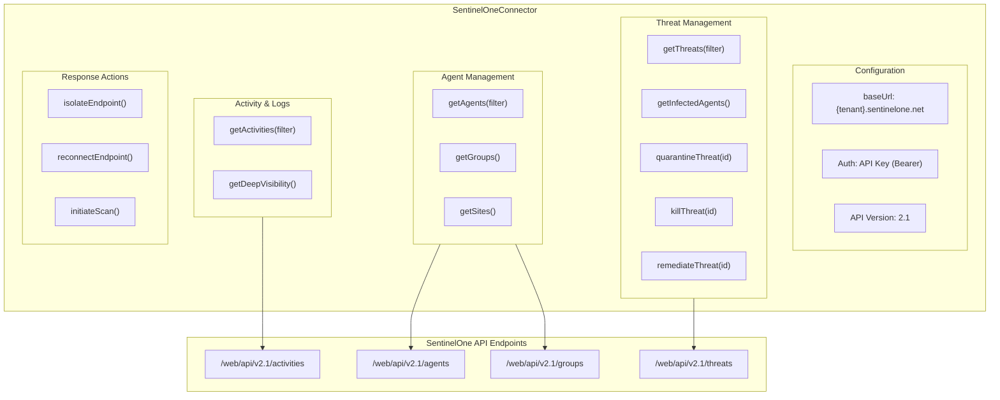
```mermaid
flowchart TB
    subgraph S1Connector["SentinelOneConnector"]
        subgraph Config["Configuration"]
            BaseURL["baseUrl: {tenant}.sentinelone.net"]
            Auth["Auth: API Key (Bearer)"]
            APIVersion["API Version: 2.1"]
        end

        subgraph ThreatModule["Threat Management"]
            GetThreats["getThreats(filter)"]
            GetInfected["getInfectedAgents()"]
            Quarantine["quarantineThreat(id)"]
            Kill["killThreat(id)"]
            Remediate["remediateThreat(id)"]
        end

        subgraph AgentModule["Agent Management"]
            GetAgents["getAgents(filter)"]
            GetGroups["getGroups()"]
            GetSites["getSites()"]
        end

        subgraph ActivityModule["Activity & Logs"]
            GetActivities["getActivities(filter)"]
            GetDeepVisibility["getDeepVisibility()"]
        end

        subgraph ResponseActions["Response Actions"]
            Isolate["isolateEndpoint()"]
            Reconnect["reconnectEndpoint()"]
            Scan["initiateScan()"]
        end
    end

    subgraph S1API["SentinelOne API Endpoints"]
        ThreatsAPI["/web/api/v2.1/threats"]
        AgentsAPI["/web/api/v2.1/agents"]
        ActivitiesAPI["/web/api/v2.1/activities"]
        GroupsAPI["/web/api/v2.1/groups"]
    end

    ThreatModule --> ThreatsAPI
    AgentModule --> AgentsAPI
    AgentModule --> GroupsAPI
    ActivityModule --> ActivitiesAPI
```

---

## 18. Tenable.io Connector - Detailed Architecture

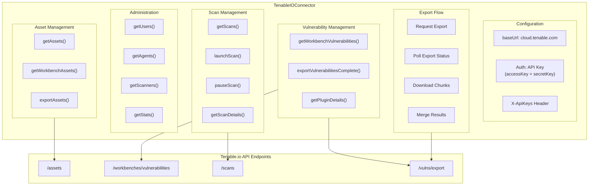
```mermaid
flowchart TB
    subgraph TIOConnector["TenableIOConnector"]
        subgraph Config["Configuration"]
            BaseURL["baseUrl: cloud.tenable.com"]
            Auth["Auth: API Key<br/>(accessKey + secretKey)"]
            Headers["X-ApiKeys Header"]
        end

        subgraph AssetModule["Asset Management"]
            GetAssets["getAssets()"]
            GetWorkbenchAssets["getWorkbenchAssets()"]
            ExportAssets["exportAssets()"]
        end

        subgraph VulnModule["Vulnerability Management"]
            GetWorkbenchVulns["getWorkbenchVulnerabilities()"]
            ExportVulns["exportVulnerabilitiesComplete()"]
            GetPlugins["getPluginDetails()"]
        end

        subgraph ScanModule["Scan Management"]
            GetScans["getScans()"]
            LaunchScan["launchScan()"]
            PauseScan["pauseScan()"]
            GetScanDetails["getScanDetails()"]
        end

        subgraph AdminModule["Administration"]
            GetUsers["getUsers()"]
            GetAgents["getAgents()"]
            GetScanners["getScanners()"]
            GetStats["getStats()"]
        end

        subgraph ExportFlow["Export Flow"]
            RequestExport["Request Export"]
            PollStatus["Poll Export Status"]
            DownloadChunks["Download Chunks"]
            MergeResults["Merge Results"]
        end
    end

    subgraph TenableAPI["Tenable.io API Endpoints"]
        AssetsAPI["/assets"]
        WorkbenchAPI["/workbenches/vulnerabilities"]
        ScansAPI["/scans"]
        ExportsAPI["/vulns/export"]
    end

    AssetModule --> AssetsAPI
    VulnModule --> WorkbenchAPI
    VulnModule --> ExportsAPI
    ScanModule --> ScansAPI

    ExportFlow --> ExportsAPI
```

---

## 19. Jira Connector - Detailed Architecture

```mermaid
flowchart TB
    subgraph JiraConnector["JiraConnector"]
        subgraph Config["Configuration"]
            BaseURL["baseUrl: {domain}.atlassian.net"]
            Auth["Auth: Basic (email:apiToken)"]
            CloudID["Cloud Instance"]
        end

        subgraph ProjectModule["Project Management"]
            GetProjects["getProjects()"]
            GetProject["getProject(key)"]
        end

        subgraph IssueModule["Issue Management"]
            GetIssues["getIssues(filter)"]
            CreateIssue["createIssue()"]
            UpdateIssue["updateIssue()"]
            DeleteIssue["deleteIssue()"]
            TransitionIssue["transitionIssue()"]
        end

        subgraph SecurityModule["Security Integration"]
            CreateSecurityTicket["createSecurityTicket()"]
            LinkVulnerability["linkVulnerability()"]
            SetPriority["setPriorityBySeverity()"]
        end

        subgraph CollaborationModule["Collaboration"]
            AddComment["addComment()"]
            AddAttachment["addAttachment()"]
            AddWatcher["addWatcher()"]
            GetComments["getComments()"]
        end

        subgraph AgileModule["Agile / Sprints"]
            GetSprints["getSprints()"]
            GetBoard["getBoard()"]
            MoveToSprint["moveToSprint()"]
        end
    end

    subgraph JiraAPI["Jira Cloud API Endpoints"]
        ProjectsAPI["/rest/api/3/project"]
        IssuesAPI["/rest/api/3/issue"]
        SearchAPI["/rest/api/3/search"]
        AgileAPI["/rest/agile/1.0/board"]
    end

    ProjectModule --> ProjectsAPI
    IssueModule --> IssuesAPI
    IssueModule --> SearchAPI
    AgileModule --> AgileAPI
```

---

## 20. HITL (Human-in-the-Loop) - Detailed Workflow

```mermaid
stateDiagram-v2
    [*] --> Pending: requestApproval()

    Pending --> AutoApproved: Risk Level in autoApproveList
    Pending --> AwaitingHuman: Risk Level requires approval

    AwaitingHuman --> Approved: Human approves
    AwaitingHuman --> Rejected: Human rejects
    AwaitingHuman --> Expired: Timeout (30 min default)

    AutoApproved --> Executing: Execute handler
    Approved --> Executing: Execute handler

    Executing --> Completed: Handler success
    Executing --> Failed: Handler error

    Rejected --> [*]
    Expired --> [*]
    Completed --> [*]
    Failed --> [*]
```

```mermaid
sequenceDiagram
    participant AI as AI Agent
    participant HITL as HITL Manager
    participant Dashboard as Approval Dashboard
    participant Human as Human Operator
    participant Handler as Action Handler
    participant Connector as Connector

    AI->>HITL: requestApproval({<br/>actionType: 'threat.quarantine',<br/>riskLevel: 'high',<br/>params: {threatId}})

    HITL->>HITL: Check autoApproveRiskLevels

    alt Low Risk (Auto-Approve)
        HITL->>Handler: Execute immediately
        Handler->>Connector: quarantineThreat()
        Connector-->>Handler: Result
        Handler-->>HITL: Completed
        HITL-->>AI: HITLRequest (status: completed)
    else High Risk (Requires Approval)
        HITL->>Dashboard: Show pending request
        HITL->>HITL: Emit onApprovalRequired
        HITL-->>AI: HITLRequest (status: pending)

        Dashboard->>Human: Display request details
        Human->>Dashboard: Approve / Reject

        alt Approved
            Dashboard->>HITL: approve(requestId, userId)
            HITL->>HITL: Emit onApproved
            HITL->>Handler: Execute action
            Handler->>Connector: quarantineThreat()
            Connector-->>Handler: Result
            Handler-->>HITL: Completed
            HITL->>HITL: Emit onCompleted
        else Rejected
            Dashboard->>HITL: reject(requestId, userId, reason)
            HITL->>HITL: Emit onRejected
        else Timeout
            HITL->>HITL: Check expiration
            HITL->>HITL: Emit onExpired
        end
    end
```

---

## 21. HITL Risk Assessment Matrix

```mermaid
flowchart TB
    subgraph RiskLevels["Risk Level Classification"]
        Low["LOW RISK<br/>Auto-Approve Eligible"]
        Medium["MEDIUM RISK<br/>Optional Approval"]
        High["HIGH RISK<br/>Required Approval"]
        Critical["CRITICAL RISK<br/>Multi-Approval Required"]
    end

    subgraph LowActions["Low Risk Actions"]
        L1["data.fetch"]
        L2["scan.status"]
        L3["agent.info"]
    end

    subgraph MediumActions["Medium Risk Actions"]
        M1["scan.launch"]
        M2["patch.schedule"]
        M3["rule.create"]
    end

    subgraph HighActions["High Risk Actions"]
        H1["threat.quarantine"]
        H2["threat.kill"]
        H3["agent.disconnect"]
        H4["policy.change"]
    end

    subgraph CriticalActions["Critical Risk Actions"]
        C1["threat.remediate"]
        C2["policy.delete"]
        C3["deployment.rollback"]
    end

    LowActions --> Low
    MediumActions --> Medium
    HighActions --> High
    CriticalActions --> Critical
```

---

## 22. Webhook Processing - Detailed Flow

```mermaid
sequenceDiagram
    participant ExtSystem as External System<br/>(SentinelOne, etc.)
    participant Webhook as Webhook Manager
    participant HMAC as HMAC Verifier
    participant Registry as Endpoint Registry
    participant Handler as Event Handler
    participant App as Application

    ExtSystem->>Webhook: POST /webhook/sentinelone<br/>{payload, X-Signature}

    Webhook->>Registry: Find endpoint config
    Registry-->>Webhook: EndpointConfig {secret, events[]}

    Webhook->>HMAC: verifySignature(payload, signature, secret)

    alt Invalid Signature
        HMAC-->>Webhook: false
        Webhook-->>ExtSystem: 401 Unauthorized
    else Valid Signature
        HMAC-->>Webhook: true
        Webhook->>Webhook: Parse event type

        alt Event type not registered
            Webhook-->>ExtSystem: 200 OK (ignored)
        else Event type registered
            Webhook->>Webhook: Create WebhookEvent
            Webhook->>Registry: Update receivedCount
            Webhook->>Handler: handler(event)
            Handler->>App: Process event
            App-->>Handler: Result
            Handler-->>Webhook: Completed
            Webhook->>Webhook: Add to event history
            Webhook-->>ExtSystem: 200 OK
        end
    end
```

---

## 23. Webhook Event Types & Sources

```mermaid
flowchart TB
    subgraph Sources["Webhook Sources"]
        S1Source["SentinelOne"]
        QualysSource["Qualys"]
        TenableSource["Tenable"]
        JiraSource["Jira"]
    end

    subgraph EventTypes["Event Types"]
        subgraph ThreatEvents["Threat Events"]
            ThreatDetected["threat.detected"]
            ThreatResolved["threat.resolved"]
            ThreatMitigated["threat.mitigated"]
        end

        subgraph VulnEvents["Vulnerability Events"]
            VulnFound["vulnerability.found"]
            VulnFixed["vulnerability.fixed"]
            VulnReopened["vulnerability.reopened"]
        end

        subgraph ScanEvents["Scan Events"]
            ScanStarted["scan.started"]
            ScanCompleted["scan.completed"]
            ScanFailed["scan.failed"]
        end

        subgraph AgentEvents["Agent Events"]
            AgentOnline["agent.online"]
            AgentOffline["agent.offline"]
            AgentUpdated["agent.updated"]
        end

        subgraph PatchEvents["Patch Events"]
            PatchMissing["patch.missing"]
            PatchInstalled["patch.installed"]
            PatchFailed["patch.failed"]
        end

        subgraph PolicyEvents["Policy Events"]
            PolicyChanged["policy.changed"]
            PolicyViolation["policy.violation"]
        end
    end

    S1Source --> ThreatEvents
    S1Source --> AgentEvents
    QualysSource --> VulnEvents
    QualysSource --> ScanEvents
    TenableSource --> VulnEvents
    TenableSource --> ScanEvents
    JiraSource --> PolicyEvents
```

---

## 24. Streaming Manager - Detailed Architecture

```mermaid
flowchart TB
    subgraph StreamManager["Stream Manager"]
        subgraph Creation["Stream Creation"]
            CreateStream["createStream&lt;T&gt;(fetchFn, options)"]
            Options["Options:<br/>- batchSize: 50<br/>- maxItems: unlimited<br/>- intervalMs: polling"]
        end

        subgraph Execution["Stream Execution"]
            AsyncGen["AsyncGenerator&lt;StreamBatch&gt;"]
            FetchPage["Fetch Page"]
            YieldBatch["Yield Batch"]
            CheckMore["Check hasMore"]
        end

        subgraph Polling["Real-time Polling"]
            StartPolling["startPolling(streamId, pollFn, interval)"]
            StopPolling["stopPolling(streamId)"]
            ActiveStreams["Active Streams Map"]
        end

        subgraph BatchStructure["StreamBatch&lt;T&gt;"]
            Items["items: T[]"]
            BatchNum["batchNumber: number"]
            IsLast["isLast: boolean"]
            Timestamp["timestamp: Date"]
        end
    end

    CreateStream --> AsyncGen
    AsyncGen --> FetchPage
    FetchPage --> YieldBatch
    YieldBatch --> CheckMore
    CheckMore -->|"hasMore"| FetchPage
    CheckMore -->|"done"| End["Stream Complete"]
```

```mermaid
sequenceDiagram
    participant App as Application
    participant SM as Stream Manager
    participant Conn as Connector
    participant API as External API

    App->>SM: createStream(fetchFn, {batchSize: 100})
    SM-->>App: AsyncGenerator<StreamBatch>

    loop For each batch
        App->>SM: next()
        SM->>Conn: fetchFn(page, limit)
        Conn->>API: GET /assets?page=N&limit=100
        API-->>Conn: {data[], total, hasMore}
        Conn-->>SM: Response

        SM->>SM: Create StreamBatch
        SM-->>App: {items[], batchNumber, isLast, timestamp}

        App->>App: Process batch items

        alt isLast === true
            SM-->>App: Generator complete
        end
    end
```

---

## 25. Semantic Search - Internal Architecture

```mermaid
flowchart TB
    subgraph SemanticSearch["Semantic Search Engine"]
        subgraph Indexing["Indexing Phase"]
            IndexVulns["indexVulnerabilities(data)"]
            IndexThreats["indexThreats(data)"]
            IndexAssets["indexAssets(data)"]
        end

        subgraph Processing["Text Processing"]
            Tokenize["Tokenize Text"]
            Lowercase["Lowercase"]
            RemoveStop["Remove Stop Words"]
            Stem["Optional Stemming"]
        end

        subgraph TFIDF["TF-IDF Calculation"]
            TF["Term Frequency (TF)<br/>count(term) / total_terms"]
            IDF["Inverse Document Frequency (IDF)<br/>log(N / docs_with_term)"]
            Score["TF-IDF Score = TF × IDF"]
        end

        subgraph Index["Index Storage"]
            DocStore["Document Store<br/>Map&lt;id, SemanticDocument&gt;"]
            InvertedIndex["Inverted Index<br/>Map&lt;term, Set&lt;docId&gt;&gt;"]
            IDFCache["IDF Cache<br/>Map&lt;term, idf_value&gt;"]
        end

        subgraph Query["Query Processing"]
            SearchQuery["search(query, options)"]
            QueryTokens["Tokenize Query"]
            CalcScores["Calculate Scores"]
            RankResults["Rank by Score"]
            Highlight["Generate Highlights"]
        end
    end

    Indexing --> Processing
    Processing --> TFIDF
    TFIDF --> Index
    SearchQuery --> QueryTokens
    QueryTokens --> Index
    Index --> CalcScores
    CalcScores --> RankResults
    RankResults --> Highlight
```

---

## 26. Semantic Document Schema

```mermaid
classDiagram
    class SemanticDocument {
        +string id
        +string content
        +DocumentMetadata metadata
    }

    class DocumentMetadata {
        +string connector
        +DocumentType type
        +string severity
        +string source
        +Date timestamp
        +object additionalData
    }

    class DocumentType {
        <<enumeration>>
        vulnerability
        asset
        threat
        log
        policy
    }

    class SemanticSearchResult {
        +SemanticDocument document
        +number score
        +string[] highlights
    }

    class SearchOptions {
        +number limit
        +number minScore
        +DocumentType[] types
        +string[] connectors
    }

    SemanticDocument --> DocumentMetadata
    DocumentMetadata --> DocumentType
    SemanticSearchResult --> SemanticDocument
```

---

## 27. Agent Orchestrator - Workflow Execution

```mermaid
flowchart TB
    subgraph WorkflowDefinition["Workflow Definition"]
        WFId["id: string"]
        WFName["name: string"]
        WFSteps["steps: WorkflowStep[]"]
        WFCallbacks["onComplete, onError"]
    end

    subgraph StepTypes["Step Types"]
        Fetch["FETCH<br/>Retrieve data"]
        Analyze["ANALYZE<br/>Process data"]
        Filter["FILTER<br/>Filter results"]
        Transform["TRANSFORM<br/>Transform data"]
        Action["ACTION<br/>Execute action"]
        Notify["NOTIFY<br/>Send notification"]
        Condition["CONDITION<br/>Branch logic"]
        Parallel["PARALLEL<br/>Concurrent steps"]
    end

    subgraph Execution["Workflow Execution"]
        Start["Start Workflow"]
        BuildGraph["Build Dependency Graph"]
        TopSort["Topological Sort"]
        ExecStep["Execute Step"]
        CheckDeps["Check Dependencies"]
        StoreResult["Store Result in Context"]
        NextStep["Next Step"]
        Complete["Complete Workflow"]
    end

    WorkflowDefinition --> Start
    Start --> BuildGraph
    BuildGraph --> TopSort
    TopSort --> ExecStep
    ExecStep --> CheckDeps
    CheckDeps -->|"deps met"| ExecStep
    ExecStep --> StoreResult
    StoreResult --> NextStep
    NextStep -->|"more steps"| CheckDeps
    NextStep -->|"done"| Complete
```

---

## 28. Workflow Step Execution Detail

```mermaid
sequenceDiagram
    participant Orch as Orchestrator
    participant Context as Workflow Context
    participant Step as Workflow Step
    participant Conn as Connector
    participant HITL as HITL Manager

    Orch->>Context: Initialize context
    Orch->>Orch: Build dependency graph

    loop For each step (topological order)
        Orch->>Step: Get step config
        Orch->>Context: Check blockedBy dependencies

        alt Dependencies not met
            Orch->>Orch: Wait for dependencies
        end

        Orch->>Step: Check condition(context)
        alt Condition false
            Orch->>Context: Skip step
        else Condition true
            alt Step type = FETCH
                Orch->>Conn: connector.method(params)
                Conn-->>Orch: Data
            else Step type = ACTION
                Orch->>HITL: Request approval (if needed)
                HITL-->>Orch: Approved
                Orch->>Conn: Execute action
                Conn-->>Orch: Result
            else Step type = TRANSFORM
                Orch->>Step: transform(data, context)
                Step-->>Orch: Transformed data
            end

            Orch->>Context: Store step result
            Orch->>Step: onSuccess(result, context)
        end
    end

    Orch->>Context: Finalize workflow
    Orch->>Orch: onComplete(context)
```

---

## 29. Pre-built Security Workflow

```mermaid
flowchart TB
    subgraph SecurityPostureWorkflow["Security Posture Assessment Workflow"]
        Step1["Step 1: Fetch Qualys Vulns<br/>type: FETCH<br/>connector: qualys"]
        Step2["Step 2: Fetch Tenable Vulns<br/>type: FETCH<br/>connector: tenable"]
        Step3["Step 3: Fetch S1 Threats<br/>type: FETCH<br/>connector: sentinelone"]
        Step4["Step 4: Normalize Data<br/>type: TRANSFORM<br/>normalizationEngine"]
        Step5["Step 5: Calculate Risk Score<br/>type: ANALYZE"]
        Step6["Step 6: Generate Report<br/>type: ACTION"]
        Step7["Step 7: Create Jira Tickets<br/>type: ACTION<br/>condition: criticalCount > 0"]
    end

    Start["Start"] --> Step1
    Start --> Step2
    Start --> Step3
    Step1 --> Step4
    Step2 --> Step4
    Step3 --> Step4
    Step4 --> Step5
    Step5 --> Step6
    Step5 --> Step7
    Step6 --> End["Complete"]
    Step7 --> End
```

---

## 30. Audit Logger - Detailed Architecture

```mermaid
flowchart TB
    subgraph AuditLogger["Audit Logger (Singleton)"]
        subgraph Config["Configuration"]
            Enabled["enabled: boolean"]
            MaxEntries["maxEntries: 10000"]
            Storage["storage: memory | custom"]
            OnEntry["onEntry callback"]
        end

        subgraph Methods["Logging Methods"]
            Log["log(entry)"]
            LogSuccess["logSuccess(action, connector, details, duration)"]
            LogFailure["logFailure(action, connector, error)"]
        end

        subgraph Query["Query Methods"]
            GetRecent["getRecentEntries(limit)"]
            GetByAction["getEntriesByAction(action)"]
            GetByConnector["getEntriesByConnector(connector)"]
            GetStats["getStats(connector?)"]
        end

        subgraph Export["Export Methods"]
            ExportCSV["exportAsCsv()"]
            ExportJSON["exportAsJson()"]
        end

        subgraph Storage["Storage"]
            Entries["AuditEntry[]"]
            Cleanup["Auto-cleanup on maxEntries"]
        end
    end

    Methods --> Storage
    Query --> Storage
    Export --> Storage
```

---

## 31. Audit Entry Schema

```mermaid
classDiagram
    class AuditEntry {
        +string id
        +AuditAction action
        +AuditStatus status
        +Date timestamp
        +number duration
        +string userId
        +string resourceId
        +string resourceType
        +object details
        +string error
        +string ipAddress
    }

    class AuditAction {
        <<enumeration>>
        connector.connect
        connector.disconnect
        data.fetch
        data.create
        data.update
        data.delete
        auth.login
        auth.logout
        auth.refresh
        scan.launch
        scan.complete
        threat.quarantine
        threat.kill
        threat.remediate
        policy.create
        policy.update
        policy.delete
        deployment.create
        deployment.execute
    }

    class AuditStatus {
        <<enumeration>>
        success
        failure
        pending
    }

    class AuditStats {
        +number total
        +number success
        +number failure
        +number successRate
    }

    AuditEntry --> AuditAction
    AuditEntry --> AuditStatus
```

---

## 32. Secrets Management - Detailed Flow

```mermaid
flowchart TB
    subgraph SecretsLayer["Secrets Management"]
        subgraph VaultHandler["Vault Handler"]
            VaultConfig["Config:<br/>- vaultUrl<br/>- token<br/>- secretPath"]
            GetSecret["getSecret(path)"]
            ListSecrets["listSecrets(path)"]
            VaultAPI["HashiCorp Vault API"]
        end

        subgraph EnvHandler["Environment Handler"]
            Prefix["Prefix: COMPLYMENT_"]
            GetEnv["getEnv(key)"]
            GetCreds["getConnectorCredentials(name)"]
            EnvMapping["Connector → Env Mapping"]
        end

        subgraph Fallback["Fallback Chain"]
            Step1["1. Check Vault"]
            Step2["2. Check Environment"]
            Step3["3. Use Config Value"]
        end
    end

    subgraph ConnectorMapping["Environment Variable Mapping"]
        QualysEnv["COMPLYMENT_QUALYS_USERNAME<br/>COMPLYMENT_QUALYS_PASSWORD"]
        S1Env["COMPLYMENT_SENTINELONE_API_KEY"]
        TenableEnv["COMPLYMENT_TENABLE_IO_ACCESS_KEY<br/>COMPLYMENT_TENABLE_IO_SECRET_KEY"]
        JiraEnv["COMPLYMENT_JIRA_EMAIL<br/>COMPLYMENT_JIRA_API_TOKEN"]
    end

    VaultHandler --> VaultAPI
    EnvHandler --> EnvMapping
    EnvMapping --> ConnectorMapping

    Step1 -->|"not found"| Step2
    Step2 -->|"not found"| Step3
```

---

## 33. Circuit Breaker State Machine - Detailed

```mermaid
stateDiagram-v2
    [*] --> Closed

    state Closed {
        [*] --> Monitoring
        Monitoring --> Monitoring: Success (reset failures)
        Monitoring --> FailureCount: Failure
        FailureCount --> Monitoring: failures < threshold
        FailureCount --> TripBreaker: failures >= threshold (5)
    }

    state Open {
        [*] --> Blocking
        Blocking --> Blocking: Reject all requests
        Blocking --> WaitRecovery: Start recovery timer
        WaitRecovery --> TimeoutReached: 60 seconds elapsed
    }

    state HalfOpen {
        [*] --> Testing
        Testing --> TestSuccess: Success
        Testing --> TestFailure: Failure
        TestSuccess --> CountSuccess: successCount++
        CountSuccess --> Testing: successCount < threshold (2)
        CountSuccess --> Reset: successCount >= threshold
    }

    Closed --> Open: TripBreaker
    Open --> HalfOpen: TimeoutReached
    HalfOpen --> Closed: Reset
    HalfOpen --> Open: TestFailure
```

```mermaid
flowchart TB
    subgraph CircuitBreaker["Circuit Breaker Configuration"]
        subgraph Thresholds["Thresholds"]
            FailureThreshold["failureThreshold: 5"]
            SuccessThreshold["successThreshold: 2"]
            RecoveryTime["recoveryTimeMs: 60000"]
        end

        subgraph Stats["CircuitBreakerStats"]
            State["state: closed|open|half-open"]
            Failures["failures: number"]
            Successes["successes: number"]
            TotalRequests["totalRequests: number"]
            LastFailure["lastFailureTime: Date"]
        end

        subgraph Callbacks["Callbacks"]
            OnStateChange["onStateChange(from, to)"]
            OnFailure["onFailure(error)"]
            OnSuccess["onSuccess()"]
        end

        subgraph Methods["Methods"]
            Execute["execute&lt;T&gt;(fn): Promise&lt;T&gt;"]
            GetState["getState(): State"]
            GetStats["getStats(): Stats"]
            Reset["reset(): void"]
            IsOpen["isOpen(): boolean"]
            IsClosed["isClosed(): boolean"]
        end
    end
```

---

## 34. LangChain Tool Conversion

```mermaid
flowchart TB
    subgraph Connector["Connector Method"]
        Method["qualys.getCriticalVulnerabilities()"]
        Params["Parameters: filter?"]
        Return["Returns: ConnectorResponse&lt;Vulnerability[]&gt;"]
    end

    subgraph Adapter["LangChain Adapter"]
        CreateTool["createTool(options)"]
        ToolOptions["ToolOptions:<br/>- name<br/>- description<br/>- schema (JSON Schema)<br/>- handler"]
    end

    subgraph LangChainTool["LangChain Tool"]
        Name["name: 'qualys_get_critical_vulnerabilities'"]
        Description["description: 'Fetch critical vulnerabilities from Qualys'"]
        Schema["schema: {type: 'object', properties: {...}}"]
        Call["call(input): Promise&lt;string&gt;"]
    end

    subgraph LLM["LLM Integration"]
        Agent["LangChain Agent"]
        ToolCall["Tool Call"]
        Result["Parse Result"]
    end

    Connector --> Adapter
    Adapter --> LangChainTool
    LangChainTool --> Agent
    Agent --> ToolCall
    ToolCall --> Call
    Call --> Method
    Method --> Result
```

---

## 35. MCP Server Tool Registration

```mermaid
sequenceDiagram
    participant App as Application
    participant MCP as MCP Server
    participant Registry as Tool Registry
    participant Conn as Connector
    participant LLM as Claude / LLM

    App->>MCP: new MCPServer({name: 'security-mcp'})

    App->>MCP: registerConnectorTools('qualys', tools)

    loop For each connector method
        MCP->>Registry: registerTool({<br/>name, description,<br/>inputSchema, handler})
    end

    App->>MCP: generateManifest()
    MCP-->>App: MCP Manifest (tools, resources)

    LLM->>MCP: List available tools
    MCP-->>LLM: Tool definitions

    LLM->>MCP: executeTool('qualys_get_vulnerabilities', {severity: 'critical'})
    MCP->>Registry: Find tool handler
    Registry->>Conn: handler(input)
    Conn-->>Registry: Result
    Registry-->>MCP: MCPToolResult
    MCP-->>LLM: Tool result
```

---

## 36. Vercel AI Tool Structure

```mermaid
classDiagram
    class VercelAITool {
        +string description
        +ZodSchema parameters
        +execute(args) Promise~any~
    }

    class VercelAIToolSet {
        +Map~string, VercelAITool~ tools
    }

    class VercelAIAdapter {
        +createTool(options) VercelAITool
        +createQualysTools(connector) VercelAIToolSet
        +createSentinelOneTools(connector) VercelAIToolSet
        +createJiraTools(connector) VercelAIToolSet
        +createFullToolSet(connectors) VercelAIToolSet
    }

    class ToolOptions {
        +string name
        +string description
        +ZodSchema schema
        +Function handler
    }

    VercelAIAdapter --> VercelAITool
    VercelAIAdapter --> VercelAIToolSet
    VercelAIAdapter --> ToolOptions
    VercelAIToolSet --> VercelAITool
```

---

## 37. Complete Data Pipeline

```mermaid
flowchart TB
    subgraph Input["Data Input"]
        QualysRaw["Qualys Raw Data"]
        TenableRaw["Tenable Raw Data"]
        S1Raw["SentinelOne Raw Data"]
        WebhookData["Webhook Events"]
    end

    subgraph Connectors["Connector Layer"]
        QConn["Qualys Connector"]
        TConn["Tenable Connector"]
        S1Conn["SentinelOne Connector"]
    end

    subgraph Processing["Processing Pipeline"]
        Fetch["1. Fetch Data"]
        Parse["2. Parse Response"]
        Validate["3. Validate Schema"]
        Normalize["4. Normalize"]
        Dedupe["5. Deduplicate"]
        Index["6. Index for Search"]
        Analyze["7. Analyze & Score"]
    end

    subgraph Output["Data Output"]
        NormData["Normalized Data"]
        SearchIndex["Search Index"]
        Alerts["Alerts & Notifications"]
        Tickets["Jira Tickets"]
        Reports["Compliance Reports"]
    end

    subgraph Audit["Audit Trail"]
        AuditLog["Audit Log"]
        Metrics["Telemetry Metrics"]
    end

    Input --> Connectors
    Connectors --> Fetch
    Fetch --> Parse
    Parse --> Validate
    Validate --> Normalize
    Normalize --> Dedupe
    Dedupe --> Index
    Index --> Analyze
    Analyze --> Output

    Fetch -.-> AuditLog
    Analyze -.-> AuditLog
    Output -.-> Metrics
```

---

## 38. Multi-Connector Security Dashboard Architecture

```mermaid
flowchart TB
    subgraph Dashboard["Security Dashboard Application"]
        UI["Dashboard UI"]
        API["Dashboard API"]
        WebSocket["Real-time Updates"]
    end

    subgraph SDK["Skillmine Connectors SDK"]
        Registry["Connector Registry"]

        subgraph Connectors["Active Connectors"]
            Q["Qualys"]
            S1["SentinelOne"]
            T["Tenable"]
            J["Jira"]
        end

        subgraph Services["SDK Services"]
            Norm["Normalization"]
            Search["Semantic Search"]
            Stream["Streaming"]
            Webhook["Webhooks"]
        end
    end

    subgraph DataFlow["Data Flows"]
        Poll["Polling (5 min)"]
        Realtime["Real-time Webhooks"]
        OnDemand["On-demand Queries"]
    end

    subgraph Views["Dashboard Views"]
        Overview["Security Overview"]
        VulnView["Vulnerability List"]
        ThreatView["Active Threats"]
        AssetView["Asset Inventory"]
        TrendView["Trend Analysis"]
    end

    UI --> API
    API --> Registry
    Registry --> Connectors
    Connectors --> Services

    Poll --> Stream
    Realtime --> Webhook
    OnDemand --> Connectors

    Services --> DataFlow
    DataFlow --> Views
    Views --> UI
    WebSocket --> UI
```

---

## Quick Links

- [Mermaid Documentation](https://mermaid.js.org/)
- [Mermaid Live Editor](https://mermaid.live/)
